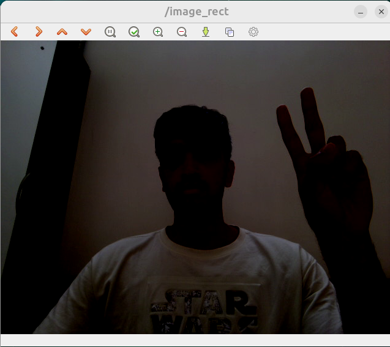
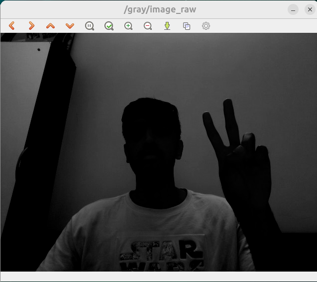
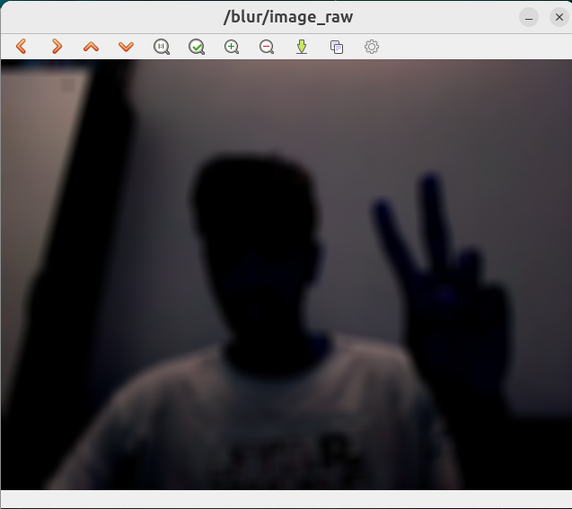
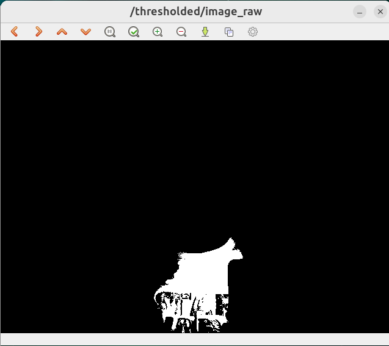
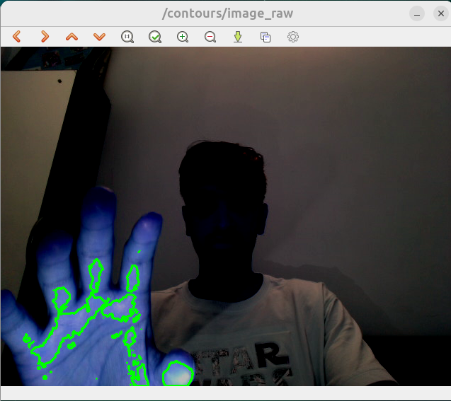
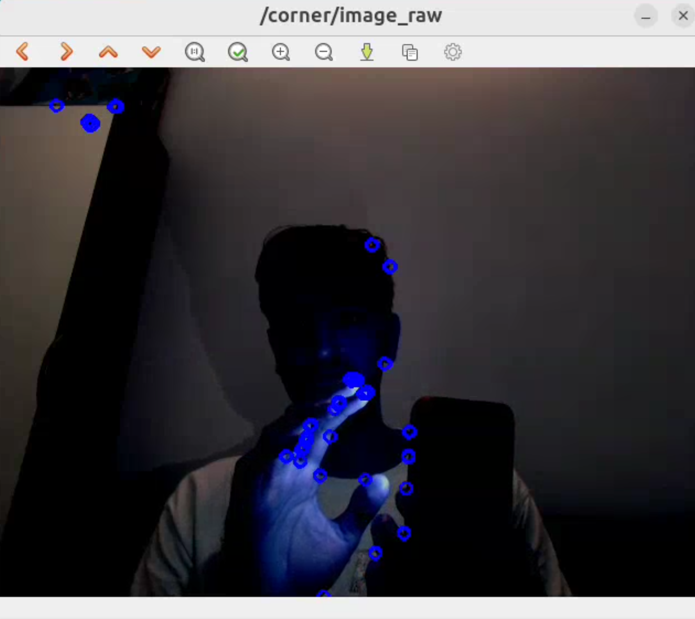
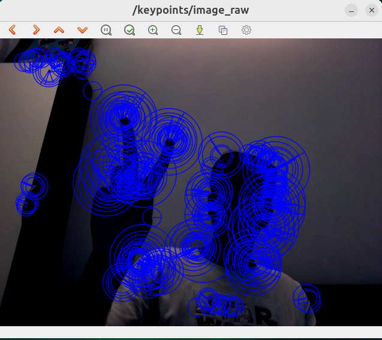

# ROS 2 Perception Stack with OpenCV

A real-time computer vision pipeline built using **ROS 2 Jazzy**, **OpenCV**, **cv_bridge**, and a camera device. The project demonstrates image acquisition, ROS image transport, and multiple OpenCV-based perception algorithms running as ROS 2 nodes.

---

## Features

- Real-time camera streaming
- ROS 2 image transport pipeline
- OpenCV integration using `cv_bridge`
- Grayscale image conversion
- Image smoothing (Blur)
- Binary thresholding
- Contour detection
- Harris corner detection
- ORB feature extraction

---

# Workspace Packages

| Package             | Description                                            |
| ------------------- | ------------------------------------------------------ |
| `usb_cam_launcher`  | Launches and configures the camera driver              |
| `my_opencv_package` | ROS 2 node implementing the OpenCV perception pipeline |

---

# Prerequisites

```bash
sudo apt install \
ros-jazzy-usb-cam \
ros-jazzy-cv-bridge \
ros-jazzy-image-tools \
libopencv-dev
```

---

# Build

```bash
source /opt/ros/jazzy/setup.bash

colcon build --symlink-install

source install/setup.bash
```

---

# 1. Launch the Camera

Start the camera node and publish live images into the ROS 2 ecosystem.

```bash
source install/setup.bash

ros2 launch usb_cam_launcher my_usb_cam.launch.py
```

The camera publishes the live stream on:

```text
/image_rect
```

### Result



---

# 2. Start the OpenCV Processing Pipeline

Launch the perception node.

```bash
source install/setup.bash

ros2 run my_opencv_package image_processing
```

The node subscribes to:

```text
/image_rect
```

and publishes processed image topics:

```text
/gray/image_raw
/blur/image_raw
/thresholded/image_raw
/contours/image_raw
/corner/image_raw
/keypoints/image_raw
```

---

# 3. Image Processing Results

## Grayscale Conversion

Converts RGB images into a single-channel intensity image.

```bash
ros2 run image_tools showimage --ros-args --remap image:=/gray/image_raw
```



---

## Image Blurring

Applies a 15×15 averaging filter to reduce image noise before feature extraction.

```bash
ros2 run image_tools showimage --ros-args --remap image:=/blur/image_raw
```



---

## Binary Thresholding

Segments the image into black and white regions using intensity thresholding.

```bash
ros2 run image_tools showimage --ros-args --remap image:=/thresholded/image_raw
```



---

## Contour Detection

Extracts the external boundaries of objects using OpenCV contour detection.

```bash
ros2 run image_tools showimage --ros-args --remap image:=/contours/image_raw
```



---

## Harris Corner Detection

Highlights high-information corner features useful for localization and tracking.

```bash
ros2 run image_tools showimage --ros-args --remap image:=/corner/image_raw
```



---

## ORB Feature Extraction

Detects rotation-invariant keypoints suitable for visual SLAM and feature matching.

```bash
ros2 run image_tools showimage --ros-args --remap image:=/keypoints/image_raw
```



---

# Technologies Used

- ROS 2 Jazzy
- rclcpp
- OpenCV
- cv_bridge
- usb_cam
- image_transport
- image_tools
- C++
- Python

---

# Repository Structure

```text
.
├── src
│   ├── my_opencv_package
│   └── usb_cam_launcher
├── docs
│   └── screenshots
├── README.md
└── .gitignore
```

---

# System Architecture

```text
USB Camera
      │
      ▼
usb_cam
      │
      ▼
 /image_rect
      │
      ▼
OpenCV Processing Node
      │
      ├────────────► /gray/image_raw
      ├────────────► /blur/image_raw
      ├────────────► /thresholded/image_raw
      ├────────────► /contours/image_raw
      ├────────────► /corner/image_raw
      └────────────► /keypoints/image_raw
```
